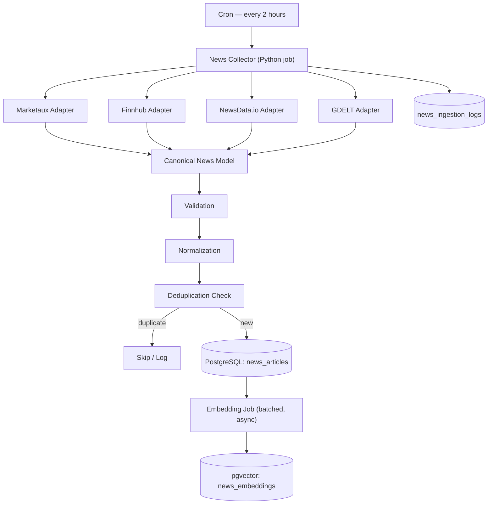
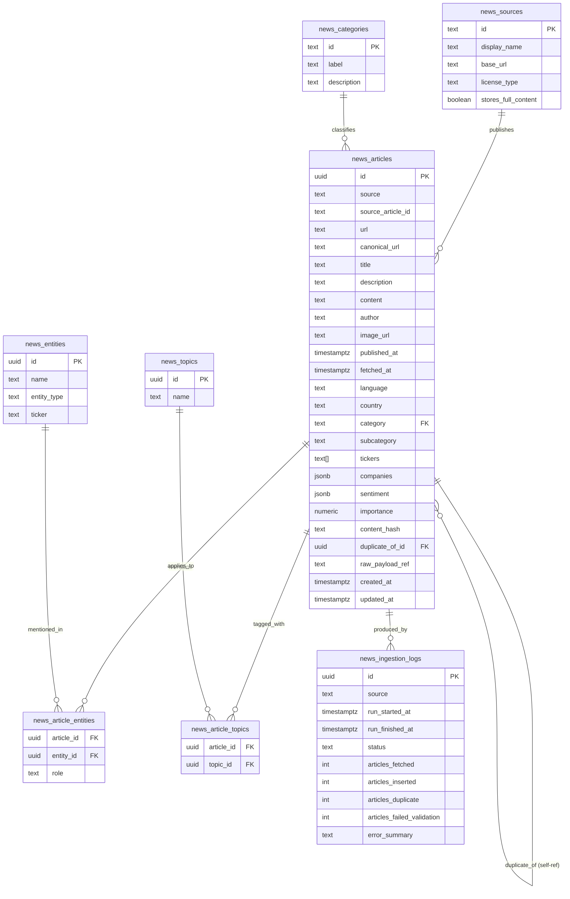

# 00 — Overview & Architecture Decision Summary

## Purpose of This Document Set

This is the phase-wise implementation guide for the **FinSight AI News Data Collection and Storage Pipeline** — the subsystem that fetches financial/geopolitical news every 2 hours, normalizes it into one canonical shape, removes duplicates, stores it in PostgreSQL, and prepares it for later semantic search.

Scope is intentionally narrow. This pipeline does **not** do portfolio impact analysis, LLM reasoning, recommendation generation, or frontend work. It produces one thing: a clean, deduplicated, queryable, embeddable table of news articles.

Read the phases in order. Each phase assumes the previous ones are done.

```
01-news-classification.md      → what categories exist and why
02-api-selection.md            → which APIs we call, and why
03-architecture.md             → how the pieces fit together
04-canonical-data-model.md     → the one schema everything maps to
05-api-adapters.md             → provider JSON → canonical object
06-normalization-validation.md → cleaning + validation rules
07-deduplication.md            → duplicate detection strategy
08-postgresql-schema.md        → tables, constraints, indexes
09-ingestion-scheduler.md      → the 2-hour job, retries, idempotency
10-vector-db-integration.md    → embeddings + pgvector strategy
11-testing.md                  → what to test at each layer
12-end-to-end-integration.md   → wiring it all together, smoke test
13-implementation-checklist.md → master checklist for the whole build
```

---

## Architecture Decision Summary

This section is the "read this if you only read one thing" summary. Full reasoning lives in the phase files linked above.

### 1. Final news categories (7, not 15)

`company`, `markets`, `economy_macro`, `central_bank_monetary_policy`, `government_regulation`, `geopolitical`, `commodities_energy`

Cross-cutting **fields** (not categories) carry the rest of the nuance: `country_scope` (india / global / region code), `subcategory` (free-form tag: earnings, m&a, ipo, tariffs, natural_disaster, credit_banking, etc.), `tickers`, `companies`. Full reasoning in `01-news-classification.md`.

### 2. Selected APIs (4 active, 2 deferred)

| API | Role | Why |
|---|---|---|
| **Marketaux** | Primary structured financial news (tickers, entities, sentiment) | Purpose-built for stock-market news, explicit entity/ticker tagging, usable free tier for dev, affordable paid tier for production |
| **Finnhub** | Company/corporate news tied to tickers | Generous free tier, strong company-news coverage, widely used in fintech stacks |
| **NewsData.io** | India/national + broad category news | Best India-market coverage among evaluated options, category + country filters, has a paid commercial tier |
| **GDELT (GDELT Project)** | Geopolitical/global event signal, metadata only | Free, effectively unlimited, huge global + multilingual coverage — but **store metadata + URL only, never full article text** (GDELT does not grant redistribution rights to source publishers' text) |
| NewsAPI.org | *Deferred* | Free tier is explicitly development-only, not usable in production; production tier is $449/mo — revisit only if the above 4 leave coverage gaps |
| Alpha Vantage News & Sentiment | *Deferred* | Free key's Terms of Service restrict use to **personal, non-commercial** purposes — disqualified for a commercial product on the free tier; revisit only under a paid plan |

Full comparison table, licensing citations, and rate limits: `02-api-selection.md`.

### 3. Scheduler approach

Plain **cron + a Python job script**, guarded by a PostgreSQL advisory lock to prevent overlap. No Celery, no Airflow, no Kafka for MVP. Revisit only if job orchestration needs (backfills, DAGs, multi-step retries across services) grow beyond what a single script can express. Full reasoning: `09-ingestion-scheduler.md`.

### 4. Canonical schema

One internal `NewsArticle` object every adapter must produce. Required fields: `source`, `source_id_or_url`, `title`, `url`, `published_at`, `fetched_at`, `category`. Everything else (`description`, `content`, `entities`, `tickers`, `sentiment`, `importance`) is optional or derived. Full field table: `04-canonical-data-model.md`.

### 5. Deduplication strategy

Four layers, cheapest-first:
1. Exact URL match (normalized URL) — unique DB constraint
2. `source` + `source_article_id` match — unique DB constraint
3. `content_hash` (normalized title + source + published date, truncated to the hour) — unique DB constraint
4. Near-duplicate detection (same story, different publisher) — **deferred past MVP**, but the schema reserves a `duplicate_of_id` self-reference so it can be added later without a migration.

Full reasoning: `07-deduplication.md`.

### 6. PostgreSQL schema

7 tables: `news_articles`, `news_sources`, `news_categories`, `news_entities`, `news_article_entities` (junction), `news_topics`, `news_ingestion_logs`. Tickers and companies are stored as columns/JSONB on `news_articles` for MVP rather than fully normalized tables — normalized entity tables are reserved for the future knowledge-graph work. Full schema: `08-postgresql-schema.md`.

### 7. Vector DB strategy

**Recommendation: pgvector inside the existing PostgreSQL instance, not a separate Pinecone/Weaviate cluster, for MVP.** One database, one connection pool, no dual-write consistency problem, no second vendor bill. Migrate to Pinecone/Weaviate later only if we hit a genuine scale or latency wall pgvector can't handle (see the explicit trigger conditions in `10-vector-db-integration.md`). The `news_articles.id` UUID is the join key either way, so the migration path stays open.

### 8. Overall ingestion architecture



### 9. MVP simplification review (Rule: "Is this actually necessary for v1?")

| Component | Status | Reason |
|---|---|---|
| Cron + Python scheduler | **MVP** | Simplest thing that satisfies "every 2 hours" |
| 4 API adapters (Marketaux, Finnhub, NewsData.io, GDELT) | **MVP** | Minimum set for company + macro + India + geopolitical coverage without redundant overlap |
| NewsAPI.org, Alpha Vantage News | **Deferred** | Cost / licensing disqualify free tiers for a commercial product |
| Canonical schema + adapters | **MVP** | Core requirement (Rule 2, Rule 3) |
| URL / source-ID / content-hash dedup | **MVP** | Cheap, deterministic, prevents obvious duplicate storage |
| Near-duplicate (semantic) dedup | **Deferred** | Needs embeddings + a similarity threshold tuning pass; not needed to have a working v1 |
| PostgreSQL structured storage | **MVP** | Core requirement |
| pgvector embeddings | **MVP** (generation), but as an **async, decoupled step** | Needed for future RAG, but must not block ingestion |
| Separate Pinecone/Weaviate | **Deferred** | pgvector is sufficient at MVP scale; adds infra & vendor cost with no current benefit |
| Knowledge graph / event-entity relationship tables | **Deferred** | Explicitly out of scope per Rule 10 |
| Sentiment scoring beyond what the API already returns | **Deferred** | Store provider-supplied sentiment as-is; no custom NLP model in this phase |
| Celery / Airflow / Kafka | **Deferred** | Cron is sufficient at this call volume (4 APIs × 12 runs/day) |
| Semantic/near-duplicate clustering, story threading | **Deferred** | Not required for storage correctness |

---

## Canonical News JSON (reference example)

```json
{
  "id": "018f2e1a-8c2e-7c3e-9b4a-1a2b3c4d5e6f",
  "source": "marketaux",
  "source_article_id": "mkx_9f2c1b7a",
  "url": "https://www.reuters.com/markets/india/rbi-holds-repo-rate-steady-2026-09-05/",
  "canonical_url": "reuters.com/markets/india/rbi-holds-repo-rate-steady-2026-09-05",
  "title": "RBI keeps repo rate unchanged at 6.5% for third straight meeting",
  "description": "The Reserve Bank of India's Monetary Policy Committee voted to hold the repo rate steady, citing inflation trends and global uncertainty.",
  "content": null,
  "author": "Reuters Staff",
  "image_url": "https://images.reuters.com/rbi-mpc-2026.jpg",
  "published_at": "2026-09-05T09:32:00Z",
  "fetched_at": "2026-09-05T10:00:14Z",
  "language": "en",
  "country": "IN",
  "category": "central_bank_monetary_policy",
  "subcategory": "interest_rate_decision",
  "topics": ["monetary-policy", "inflation", "rbi"],
  "entities": ["Reserve Bank of India", "Monetary Policy Committee"],
  "tickers": [],
  "companies": [],
  "sentiment": {"label": "neutral", "score": 0.02},
  "importance": 0.8,
  "content_hash": "b7e1f4a9c2d8e6f01a3b5c7d9e0f1a2b3c4d5e6f7a8b9c0d1e2f3a4b5c6d7e8f",
  "duplicate_of_id": null,
  "raw_payload_ref": "s3://finsight-raw-news/marketaux/2026-09-05/mkx_9f2c1b7a.json",
  "created_at": "2026-09-05T10:00:15Z",
  "updated_at": "2026-09-05T10:00:15Z"
}
```

Full field-by-field documentation (type, nullability, source, indexed?, required for embeddings?) is in `04-canonical-data-model.md`.

---

## Database ER Diagram (reference — full detail in 08-postgresql-schema.md)



---

## Master Implementation Checklist

See `13-implementation-checklist.md` for the full, ordered checklist covering all phases.

## Next

Start with `01-news-classification.md`.

---

## ⚡ As-Built Summary (current state of implementation)

> This section captures the key divergences between the original plan and what is currently built. Each point links back to the phase file where the full as-built note lives.

| Plan decision | As-built reality | Phase |
|---|---|---|
| 4 providers: Marketaux, Finnhub, NewsData.io, GDELT | 2 providers: **Finnhub** (implemented) + **NewsAPI** (implemented, dev-only tier) | `02-api-selection.md` |
| Canonical `NewsArticle` with 15+ fields, UUID id, 7-category enum, `fetched_at`, `content_hash` | Simple `ArticleCreate` with 5 fields (`title`, `source`, `published_time`, `url`, `content`); `Article` adds NLP fields post-processing | `04-canonical-data-model.md` |
| 7-table PostgreSQL schema with lookup tables, junction tables, ingestion logs | **Single `articles` table** with integer PK, URL unique constraint, NLP fields on the same row | `08-postgresql-schema.md` |
| 3-level dedup: canonical_url + source+ID + content_hash constraints | **Level-1 URL match only**: application-layer `filter(url == ...)` + `url UNIQUE` DB index | `07-deduplication.md` |
| pgvector inside PostgreSQL for embeddings | **External Qdrant** instance; 1024-dim BGE-Large vectors; `qdrant_point_id` stored on article row | `10-vector-db-integration.md` |
| Embedding-only processing step | **Full NLP pipeline**: BGE-Large embedding → sector classification → NER → relation extraction → Qdrant upsert → KG node/edge/similarity wiring | `10-vector-db-integration.md` |
| Cron + PostgreSQL advisory lock + `news_ingestion_logs` | **FastAPI endpoint-triggered** ingestion; no advisory lock; no ingestion log table | `09-ingestion-scheduler.md` |
| `services.py` as part of the formal src/ package | `services.py` lives at the project root alongside `models.py` and `schemas.py` | Architecture |

The above divergences are all **intentional simplifications or feature accelerations** for the MVP build. The original plan remains valid as the target architecture for a production-hardened version. Each phase file's "⚡ Actual Implementation Note" section documents the full detail.
