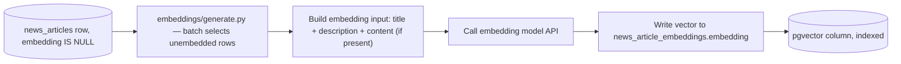

# 10 — Vector Database Integration

## Objective

Prepare stored news articles for semantic search: decide the vector storage approach (pgvector vs. a separate vector database), define the embedding pipeline, and decide what identifier and metadata connect a structured record to its vector representation.

## Why This Phase Exists

FinSight's eventual RAG reasoning depends on semantic retrieval over news. This phase makes sure the schema and pipeline support that without prematurely committing to infrastructure the MVP doesn't need.

## Prerequisites

`08-postgresql-schema.md` completed (news_articles table exists and is being populated).

## Decisions

### Option A vs. Option B

**Option A: PostgreSQL + pgvector.** Embeddings stored as a `vector` column in the same PostgreSQL instance as the structured data.

**Option B: PostgreSQL + Pinecone/Weaviate.** Structured data in PostgreSQL, embeddings in a separate managed vector database, joined by a shared ID.

| Factor | Option A (pgvector) | Option B (Pinecone/Weaviate) |
|---|---|---|
| Infra to operate | One database, already running | A second managed service — separate account, separate billing, separate uptime dependency |
| Consistency | A single transaction can insert the article and its embedding together (or at least query both in one connection) | Requires a dual-write path; article and vector can drift out of sync if one write succeeds and the other fails |
| Query capability | SQL filters (category, country, published_at, tickers) combined with vector similarity in **one query** | Requires the vector DB to support metadata filtering equivalent to the SQL filters, and keeping that metadata in sync with PostgreSQL as a second source of truth |
| Cost at MVP scale | No incremental vendor cost | Additional vendor bill, sized for a scale FinSight doesn't have yet |
| Operational complexity | Low — one connection pool, one backup strategy | Higher — two systems to monitor, two failure modes |
| Ceiling / scale | Good up to roughly low-tens-of-millions of vectors with HNSW/IVFFlat indexing (well beyond FinSight's near-term article volume: 4 providers × ~50-200 articles per run × 12 runs/day is on the order of a few thousand articles/day) | Purpose-built for very large-scale, very high-QPS vector search; the advantage only matters once actually operating at that scale |

### Recommendation: Option A (pgvector) for MVP

This directly follows Rule 1 (MVP first) and the requirements' explicit instruction not to default to a separate vector DB just because the original architecture document mentioned Pinecone/Weaviate. pgvector removes an entire category of dual-write consistency bugs and a second vendor relationship, for a workload that is nowhere near the scale where a dedicated vector database's advantages would matter.

**Explicit migration trigger conditions** (revisit this decision, don't preemptively build for them):
- Article + embedding volume approaches the range where pgvector's index build/query latency becomes a measured, documented problem (not a hypothetical one).
- A genuine need emerges for vector search features pgvector doesn't support well (e.g., very high-QPS approximate search at a scale PostgreSQL's connection model struggles with).
- A separate service (not FinSight's own backend) needs direct vector-search access without going through the FastAPI layer.

Because `news_articles.id` is the join key in both options, choosing Option A now does not foreclose Option B later — a future migration script can read `(id, embedding)` pairs out of pgvector and upsert them into Pinecone/Weaviate with metadata reconstructed from the same `news_articles` row.

### Embedding pipeline



- **Decoupled from ingestion**: runs as its own step, either at the end of the same 2-hour job (simplest — one extra step after insert, still inside the single cron invocation, still respecting the "don't block insertion" principle from `03-architecture.md` because it happens after inserts are already committed) or as a separate, more frequent small job. **Decision for MVP: run it as the final step of the same `run_ingestion.py` job**, selecting any `news_articles` row without a corresponding embedding row (not just ones from this run — this also catches anything that failed embedding in a previous run). A separate, more frequent embedding job is a documented future optimization if embedding latency ever becomes long enough to meaningfully delay the next scheduled run.
- **Batched**: embeds multiple articles per API call where the embedding provider supports batch input, to reduce call count and cost.
- **Failure isolation**: a failed embedding call for one article is logged and skipped — it does not fail the whole job, and does not roll back the article's insertion. The article exists and is queryable by structured filters immediately; it simply isn't yet semantically searchable until a later run successfully embeds it.
- **What is embedded**: `title` + `description` (if present) + `content` (if present and license-permitted) — see `04-canonical-data-model.md`. GDELT articles (no `content`) embed on `title` + `description` only, which is still useful for retrieval even without full body text.

### Identifier connecting PostgreSQL and the vector store

`news_articles.id` (UUID) is the sole join key. The embeddings table stores it as a foreign key, not a separately-generated document ID — there is exactly one identifier for "this article" across the whole system, by design, so there is never a reconciliation problem between "the structured record" and "the vector record."

### Metadata stored with the vector

Stored as normal PostgreSQL columns alongside the vector (not duplicated as JSON blobs), enabling combined SQL `WHERE` + vector-distance queries in one statement:

| Metadata field | Useful for filtering because |
|---|---|
| `news_id` (== `news_articles.id`) | Join key |
| `source` | "only trust wire-service X" type filters |
| `category` | The single most common filter — e.g., "only central_bank_monetary_policy articles" |
| `subcategory` | Finer-grained filter once category narrows the set |
| `published_at` | Recency filtering/boosting, and time-range-scoped semantic search |
| `country` | India-vs-global scoping |
| `tickers` | Combine "semantically similar to this query" with "and mentions ticker X" |
| `companies` | Same purpose as tickers, for named-company filtering when no ticker is available |
| `topics` | Optional secondary filter |
| `importance` | Can be used to boost/re-rank retrieved results, not just filter |

`language`, `author`, `image_url`, `raw_payload_ref` are **not** duplicated as vector metadata — they're display/provenance concerns, fetched from `news_articles` directly via the join key when needed, not something a similarity query filters on.

## Implementation Steps

```text
Step 1 — Enable the pgvector extension: CREATE EXTENSION IF NOT EXISTS vector;
Step 2 — Create news_article_embeddings table (below) with a vector column sized to the chosen embedding model's dimension.
Step 3 — Implement embeddings/generate.py: select unembedded articles, build input text, call the embedding API in batches, write results.
Step 4 — Add the embedding step as the final stage of scheduler/run_ingestion.py, wrapped in its own try/except so embedding failures never affect the job's overall success status for the ingestion portion.
Step 5 — Create an HNSW (or IVFFlat, depending on pgvector version available) index on the embedding column once there's enough data for the index to be worth building (document this as a follow-up once article volume is non-trivial — an index on a near-empty table is not harmful, but also not something to over-tune on day one).
Step 6 — Write a manual smoke-test query combining a vector similarity search with a `category = 'geopolitical'` filter to confirm the combined query pattern works end-to-end.
```

## Files to Create/Modify

```text
src/news/embeddings/
├── __init__.py
└── generate.py
migrations/
└── 006_create_news_article_embeddings.py
```

## Database Changes

```sql
CREATE EXTENSION IF NOT EXISTS vector;

CREATE TABLE news_article_embeddings (
    news_id UUID PRIMARY KEY REFERENCES news_articles(id) ON DELETE CASCADE,
    embedding VECTOR(1536),   -- dimension depends on the chosen embedding model; adjust to match
    source TEXT,
    category TEXT,
    subcategory TEXT,
    published_at TIMESTAMPTZ,
    country TEXT,
    tickers TEXT[],
    companies JSONB,
    topics TEXT[],
    importance NUMERIC,
    embedded_at TIMESTAMPTZ NOT NULL DEFAULT now()
);

CREATE INDEX idx_news_article_embeddings_category ON news_article_embeddings (category);
CREATE INDEX idx_news_article_embeddings_published_at ON news_article_embeddings (published_at DESC);
-- Vector index (HNSW example; add once article volume justifies it):
-- CREATE INDEX idx_news_article_embeddings_vector ON news_article_embeddings
--     USING hnsw (embedding vector_cosine_ops);
```

## Configuration

```text
EMBEDDING_MODEL_NAME=
EMBEDDING_MODEL_DIMENSION=1536
EMBEDDING_API_KEY=
EMBEDDING_BATCH_SIZE=50
```

## Testing

```text
- Test: an article without an embedding row is correctly selected by the "unembedded" query.
- Test: embedding generation failure for one article does not stop the batch or affect the ingestion job's success status.
- Test: a combined SQL query (vector similarity + category filter) returns correctly filtered, correctly ranked results against a small fixture dataset.
- Test: news_article_embeddings.news_id has no orphaned rows (every row's news_id exists in news_articles) — guaranteed by the FK, but worth a smoke test after bulk operations.
```

## Expected Result

Every stored article eventually has a corresponding row in `news_article_embeddings`, queryable via a combined structured-filter + vector-similarity query, using pgvector inside the existing PostgreSQL instance — no separate vector database deployed for MVP.

## Acceptance Criteria

```text
- [ ] pgvector extension enabled
- [ ] news_article_embeddings table created with the documented metadata columns
- [ ] Embedding generation runs as a decoupled, failure-isolated step after article insertion
- [ ] Combined structured-filter + vector-similarity smoke-test query works
- [ ] Migration path to Pinecone/Weaviate documented (join key: news_articles.id) even though not built
```

## Dependencies / Next Phase

`11-testing.md` specifies tests across every phase, including this one; `12-end-to-end-integration.md` wires the full pipeline including this step into one verified flow.
